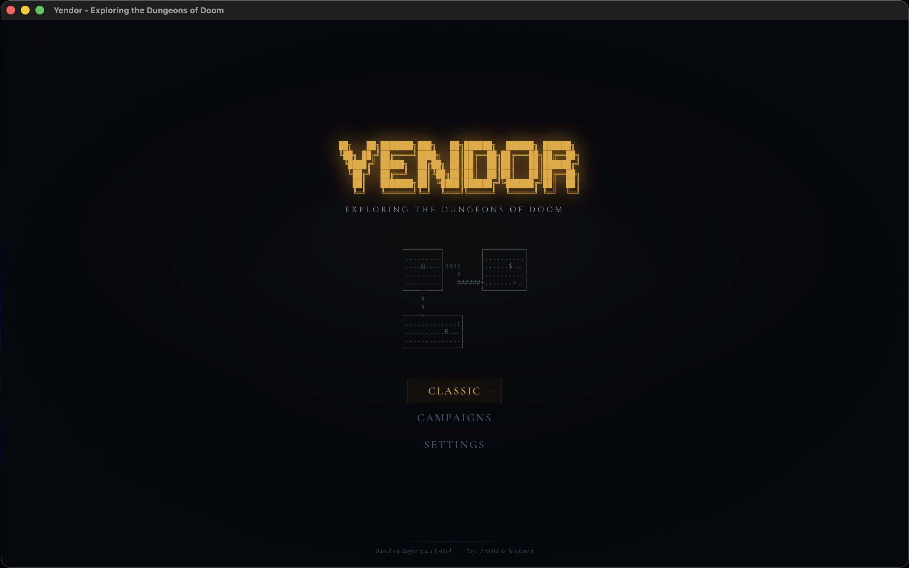
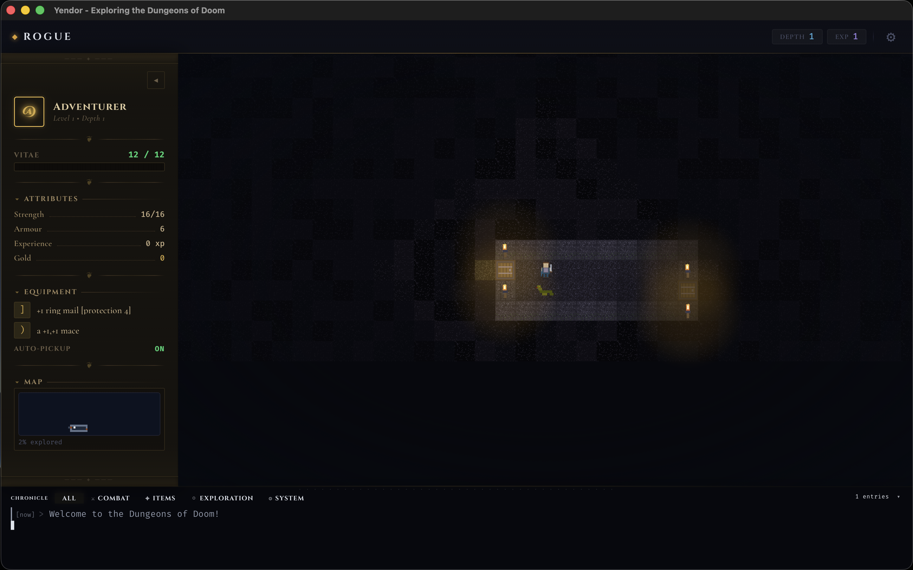
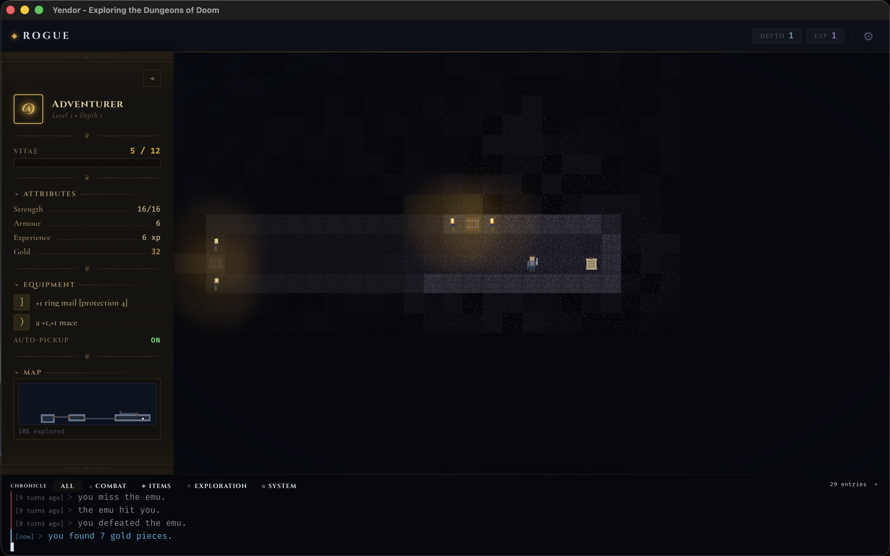
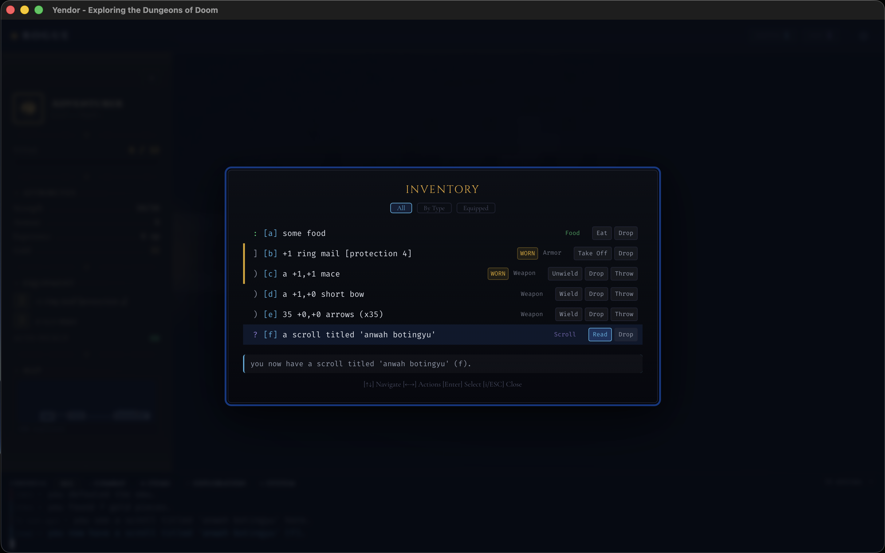
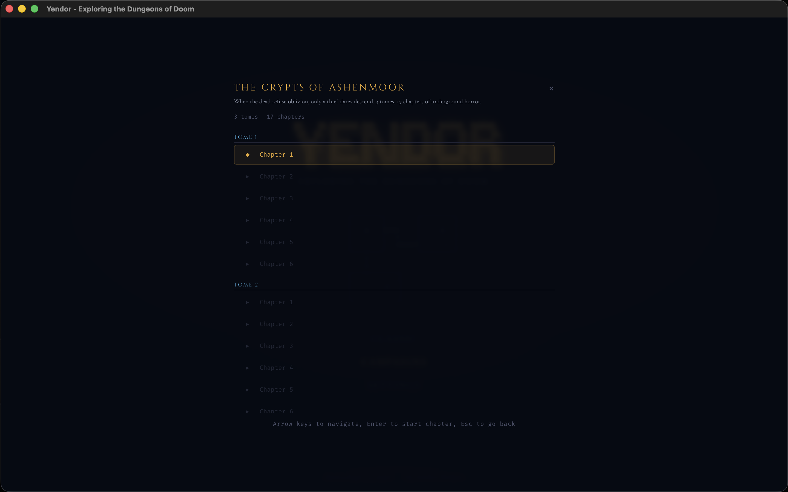
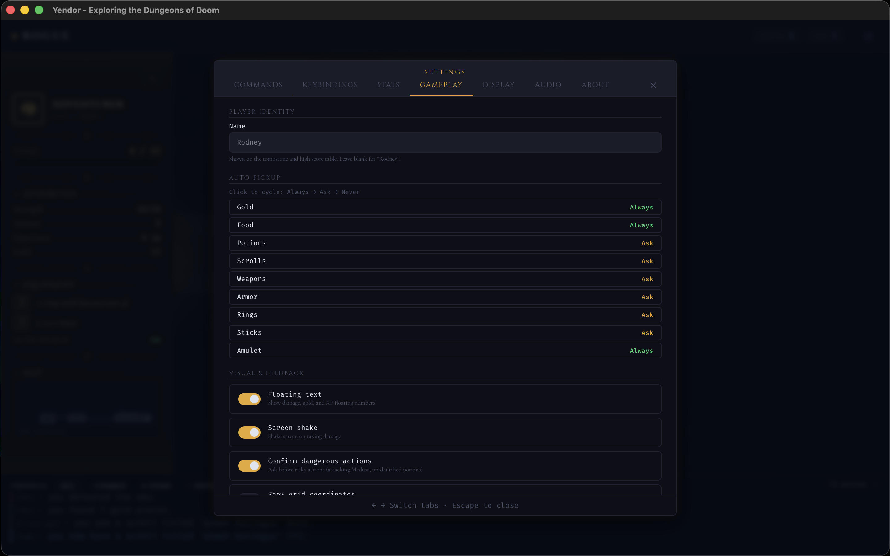

# YendorSupport

<!-- Badges: Row 1 — Identity -->

<!-- Badges: Row 2 — Activity -->

Marketing site, privacy policy, and support hub for [Yendor](https://apps.apple.com/app/yendor/id6746498844) — a faithful reimplementation of the classic roguelike Rogue 5.4.4.

## Links

- **Download**: [Mac App Store](https://apps.apple.com/app/yendor/id6746498844)
- **Website**: https://atypical-consulting.github.io/YendorSupport/
- **Privacy Policy**: https://atypical-consulting.github.io/YendorSupport/privacy
- **Support / Bug Reports**: https://github.com/Atypical-Consulting/YendorSupport/issues

## Screenshots

| Title Screen | Dungeon Exploration |
|:---:|:---:|
|  |  |

| Combat Gameplay | Inventory Management |
|:---:|:---:|
|  |  |

| Campaign Selection | Settings |
|:---:|:---:|
|  |  |

## About Yendor

Yendor is built with Rust + Tauri 2 + React 19. It preserves every mechanic from the original 1980 Rogue while adding saga campaigns and pixel art visuals.

Developed by [phmatray](https://github.com/phmatray) at [Atypical Consulting](https://github.com/Atypical-Consulting).

---

Built with care by [Atypical Consulting](https://atypical.garry-ai.cloud) — opinionated, production-grade open source.

