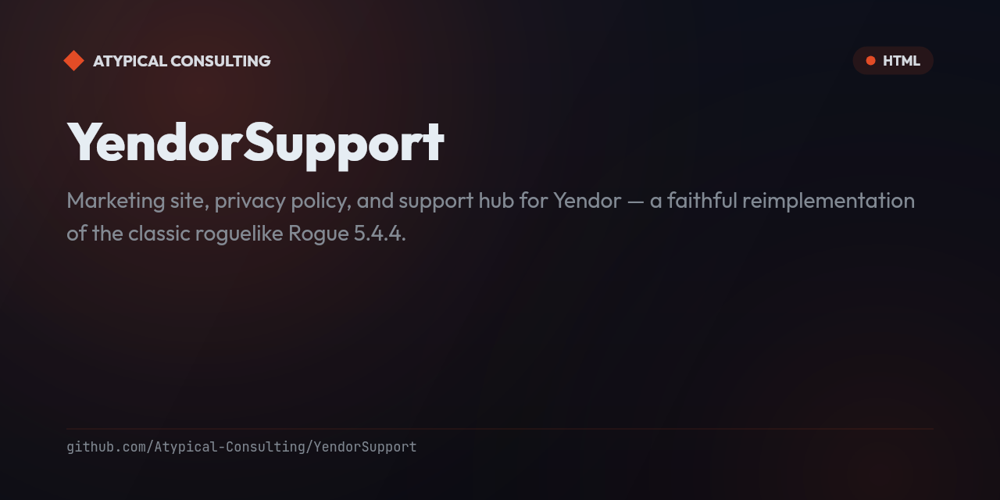
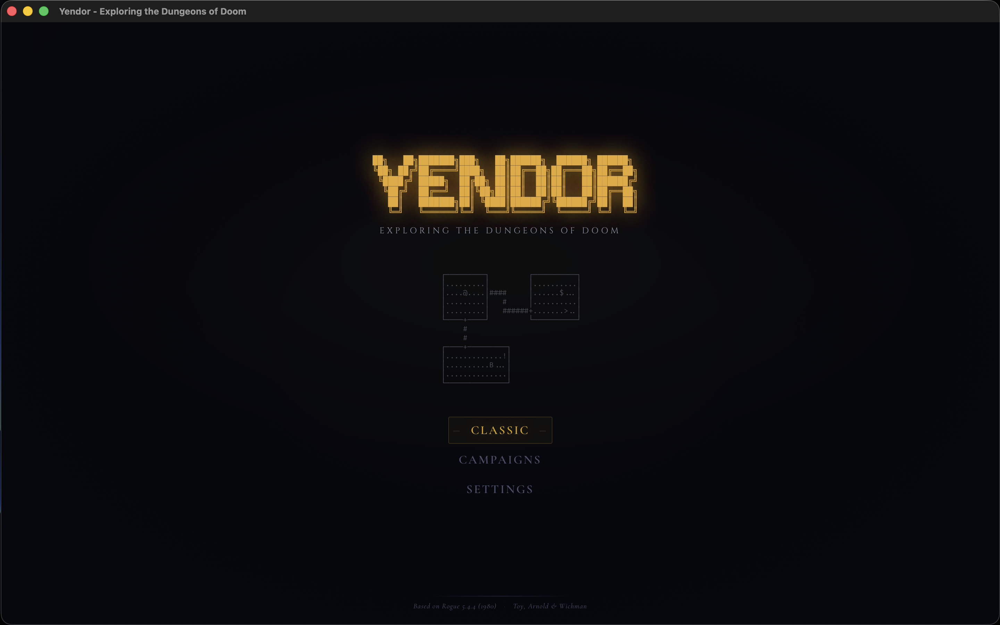
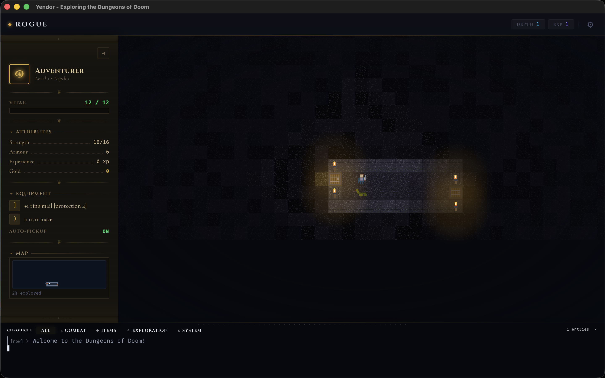
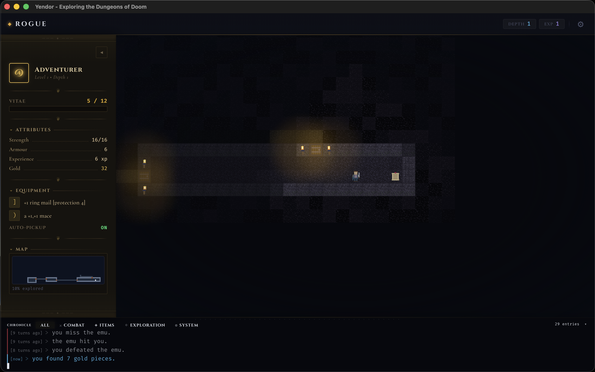
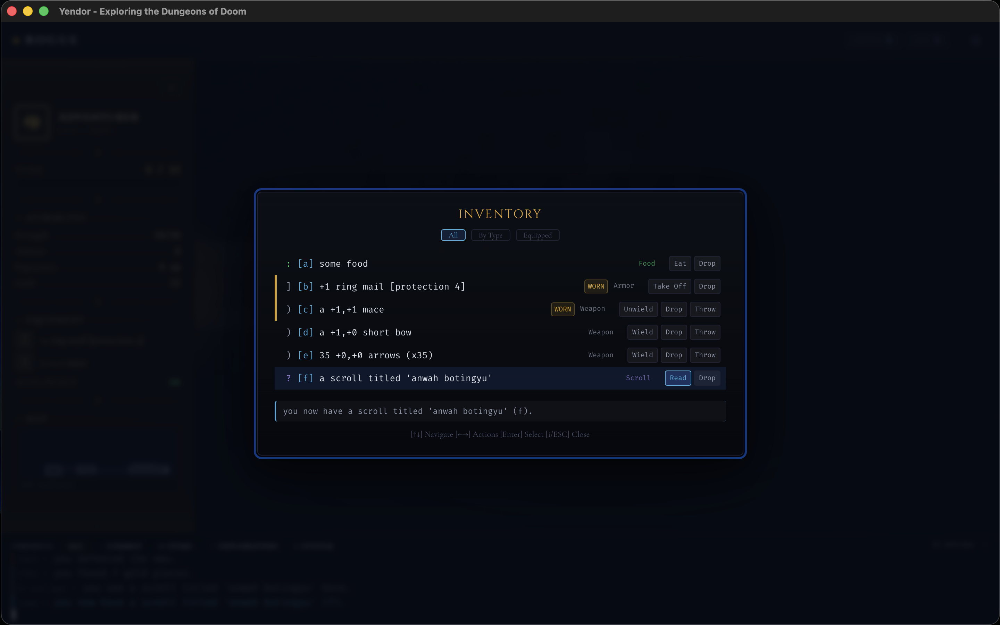
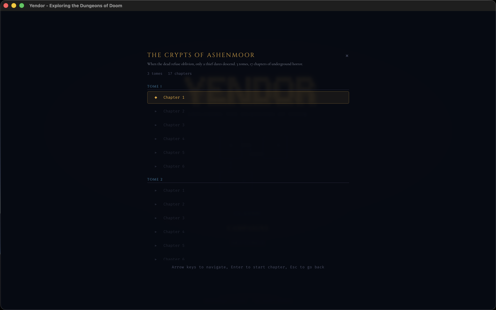
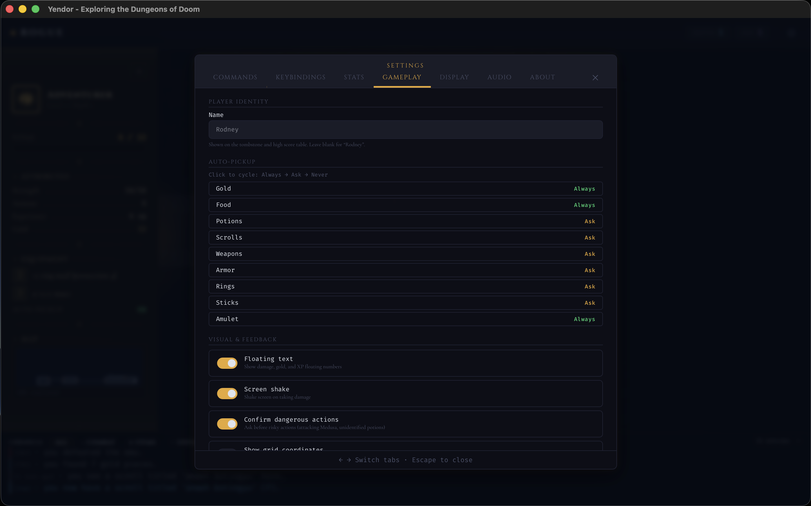

# YendorSupport

<!-- portfolio-toc:start -->

## Table of Contents

- [Features](#features)
- [Usage](#usage)
- [Links](#links)
- [Screenshots](#screenshots)
- [About Yendor](#about-yendor)
- [Roadmap](#roadmap)
- [Contributing](#contributing)
- [License](#license)

<!-- portfolio-toc:end -->


<!-- Badges: Row 1 — Identity -->
[](https://github.com/Atypical-Consulting/YendorSupport)
[](https://github.com/Atypical-Consulting/YendorSupport)
[](https://github.com/Atypical-Consulting/YendorSupport)

<!-- Badges: Row 2 — Activity -->
[](https://github.com/Atypical-Consulting/YendorSupport/issues)
[](https://github.com/Atypical-Consulting/YendorSupport/pulls)
[](https://github.com/Atypical-Consulting/YendorSupport/commits/main)

Marketing site, privacy policy, and support hub for [Yendor](https://apps.apple.com/app/yendor/id6746498844) — a faithful reimplementation of the classic roguelike Rogue 5.4.4.

## Features

This repo is the game's public-facing site, not the game itself:

- **Marketing landing page** (`index.md`) — hero, feature grid and a screenshot gallery, built with Jekyll and deployed via `github-pages` on GitHub Pages.
- **Privacy policy** (`privacy.md`) — the policy page required for the Mac App Store listing.
- **Screenshot gallery** — six in-game screenshots (title, exploration, combat, inventory, campaigns, settings) served from `screenshots/`.
- **SEO & sharing metadata** — `jekyll-seo-tag` and `jekyll-sitemap` plugins with per-page `image`/`description` front matter for search and social previews.
- **Support entry point** — routes bug reports straight to the [GitHub issue tracker](https://github.com/Atypical-Consulting/YendorSupport/issues).
- **Automated dependency updates** — `renovate.json` keeps the Jekyll/Ruby gems current.

## Usage

This is a static [Jekyll](https://jekyllrb.com) site, published automatically via GitHub Pages. To preview it locally:

```bash
bundle install
bundle exec jekyll serve
```

Then open `http://localhost:4000/YendorSupport/` (the site's `baseurl` in `_config.yml` is `/YendorSupport`). The live site is at https://atypical-consulting.github.io/YendorSupport/.

## Links

- **Download**: [Mac App Store](https://apps.apple.com/app/yendor/id6746498844)
- **Website**: https://atypical-consulting.github.io/YendorSupport/
- **Privacy Policy**: https://atypical-consulting.github.io/YendorSupport/privacy
- **Support / Bug Reports**: https://github.com/Atypical-Consulting/YendorSupport/issues

## Screenshots

| Title Screen | Dungeon Exploration |
|:---:|:---:|
|  |  |

| Combat Gameplay | Inventory Management |
|:---:|:---:|
|  |  |

| Campaign Selection | Settings |
|:---:|:---:|
|  |  |

## About Yendor

Yendor is built with Rust + Tauri 2 + React 19. It preserves every mechanic from the original 1980 Rogue while adding saga campaigns and pixel art visuals.

Developed by [phmatray](https://github.com/phmatray) at [Atypical Consulting](https://github.com/Atypical-Consulting).

---

Built with care by [Atypical Consulting](https://atypical.garry-ai.cloud) — opinionated, production-grade open source.

[](https://github.com/Atypical-Consulting/YendorSupport/graphs/contributors)

---

## Roadmap

- [ ] Add a changelog / "what's new" page as saga campaigns ship
- [ ] Add a press kit page (logo, screenshots, boilerplate) for coverage requests
- [ ] Add a lightweight FAQ / troubleshooting section to cut down duplicate support issues
- [ ] Track App Store badge click-throughs to measure how the site converts

See the [open issues](https://github.com/Atypical-Consulting/YendorSupport/issues) for details.

---

<!-- portfolio-techstack:start -->

## Tech Stack

- **HTML**

<!-- portfolio-techstack:end -->

<!-- portfolio-sections:start -->

## Contributing

Contributions are welcome. Open an issue first to discuss any significant change.

1. Fork the repository and create your branch (`git checkout -b feat/my-feature`)
2. Commit your changes (`git commit -m 'feat: ...'`)
3. Push the branch and open a Pull Request

## License

No license has been declared for this repository yet. Until one is added, default copyright applies — see [choosealicense.com](https://choosealicense.com/) if you intend to open it up.

<!-- portfolio-sections:end -->
